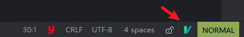
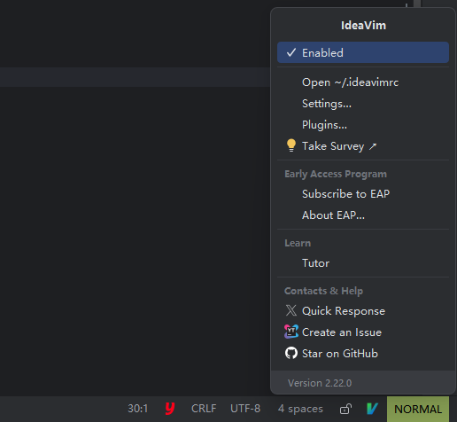
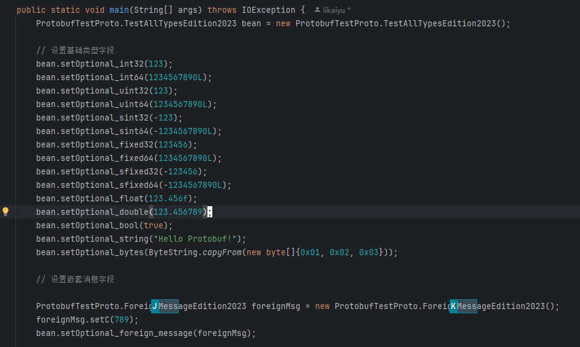

从大学开始学习编程到现在一共用了三种代码编辑器

+ Eclipse
+ Idea
+ NeoVim

Eclipse 就不说了，当时刚入门的时候很多人推荐用，后来参加学校比赛也是要用这个，不过比赛结束后就切到了 Idea。

后来有次刷知乎的时候看到别人把 vim 改造成了代码编辑器，代码高亮、语法提示、编译运行这些都可以支持。当时正好在学习 Go 语言，抱着搞技术就是瞎折腾的心态就开始在 WSL 里用 NeoVim 搭建 Go 的开发环境。一开始的时候津津有味，找各种有意思的插件来用。新鲜劲过了以后就越来越折磨，包括但不限于依赖下载不下来（Github 网络问题）、大量配置搞的头疼，解决各种报错问题。最后花了两个星期的时间配置好后发现纯粹是没苦硬吃，开发效率不如 Idea 一根。果断弃用，但是 vim 的键位倒是熟悉了不少。

遂决定取长补短，在 Idea 的编辑器中使用 vim 插件来写代码。经过三年的使用后，事实证明这样的确提升了我的效率。写代码的时候右手很少去动鼠标，双手绝大部分时间只用放在键盘上，更加的专注。配合一些插件能让我代码写的更加丝滑，当然也能一定程度上缓解下鼠标手的症状。

## 插件

### IdeaVim

要在 Idea 中实现 vim 的操作方式需要安装 `IdeaVim` 插件。


安装完成以后右下角会出现一个 **V** 的 icon



可以点击打开菜单，选择启用或者关闭



这个时候就能在代码的编辑器框中实现基本的 vim操作了。在一些 vim 的快捷键和 Idea 自带的快捷键冲突的时候，Idea 会弹出一个提示让你选择该快捷键的行为归属于哪一方，这样可以保留下你觉得 Idea 更好用的快捷键。

接下来还能再安装一些插件来提升使用体验，我把我用的一些插件和功能都列举在下面

### AceJump  + IdeaVim-EasyMotion

`AceJump`  + `IdeaVim-EasyMotion` 搭配使用实现光标的高效跳转


我设置的开始快捷键是按两下 **s** ，然后输入你想跳转代码位置的字符

比如这里我输入 **Mess** ，就可以高亮的显示出所有 Mess 开头的地方，然后再输入显示的跳转键(下图是 J、K)就可以将光标跳转过去。



### NREDTree

还有 vim 中控制目录的插件 `NREDTree` ，这个不需要额外安装插件，只需要在配置文件中设置开启就行

```vim
set NERDTree
```


## 配置文件

### 推荐配置

这里大概说下一些我觉得很好用的配置

我为了尽快适应 vim 的上下左右移动（jkhl）移动，直接禁用了方向键的移动

```vim
" 普通模式下禁止方向键
nnoremap <Down><Nop>
nnoremap <Up><Nop>
nnoremap <Left><Nop>
nnoremap <Right><Nop>
```

按两下 **;** 给行尾直接添加分号

```vim
" 行尾加;
map ;; <Esc>A;<Esc>
inoremap ;; <Esc>A;<Esc>
```

切换 Normal 模式默认是 **ESC** ，这个按键比较远，所以也添加了一个映射

```vim
" 快速进入普通模式
inoremap jj <Esc>
inoremap jk <Esc>
```

把 Leader 键修改为空格键

```java
let mapleader = " "
```

搜索的时候忽略大小写和系统的剪切板通用

```java
" 搜索忽略大小写
:set ignorecase
" 内外剪切板通用
:set clipboard=unnamed
```


### 完整配置

这里是目前用到的整个配置文件

```vim
Plug 'preservim/nerdtree'

" 插件
set NERDTree
let g:EasyMotion_override_acejump = 0
let mapleader = " "
set easymotion
" 在文本两端操作 cs"' -> 就是替换两边的双引号为单引号
set surround
" 注释相关
set commentary
" 操作函数参数，文档 https://www.vim.org/scripts/script.php?script_id=2699
set argtextobj
" 执行复制或剪切操作后，短暂的高亮提示
set highlightedyank

" 搜索忽略大小写
:set ignorecase
" 内外剪切板通用
:set clipboard=unnamed

" 普通模式下禁止方向键
nnoremap <Down><Nop>
nnoremap <Up><Nop>
nnoremap <Left><Nop>
nnoremap <Right><Nop>

" 插入模式下禁止方向键
inoremap<Down><Nop>
inoremap <Up><Nop>
inoremap <Left><Nop>
inoremap <Right><Nop>

" 断点
map <c-m> <action>(ToggleLineBreakpoint)

" 预览所有断点
map <Leader>vb <action>(ViewBreakpoints)

" 行尾加;
map ;; <Esc>A;<Esc>
inoremap ;; <Esc>A;<Esc>

" 当前行代码上下移动
map <Leader>j <action>(MoveStatementDown)
map <Leader>k <action>(MoveStatementUp)

" 快速进入普通模式
inoremap jj <Esc>
inoremap jk <Esc>
" inoremap kk <Esc>

" 编译
map <Leader>b <action>(CompileDirty)<CR>
nmap ss <Action>(AceAction)

" NERDTree 快捷键
nmap <leader>tt :NERDTreeToggle<CR>

" 注释当前行
" nnoremap gcc :action CommentByLineComment<CR>

" 查看文件结构
map <leader>o <action>(FileStructurePopup)

" Debug的时候执行表达式
map <leader>u <action>(EvaluateExpression)

" 当前项目搜索
map <leader>h <action>(FindInPath)

" 在弹出列表中上下移动不生效
" map <c-j> <action>(EditorDown)
" map <c-k> <action>(EditorUp)

" 关闭当前窗口
map <c-w> <action>(CloseContent)

" 前进和后退
map <M-k> <action>(Forward)
map <M-j> <action>(Back)

" 快速文档
map gh <Action>(QuickImplementations)

" 格式化
map <leader>f <Action>(ReformatCode)

" 打开/关闭 版本管理软件的信息
map <leader>a <Action>(Annotate)

" 在目录中找到当前打开的文件
map <leader>t <Action>(SelectInProjectView)set clipboard^=ideaput


```


