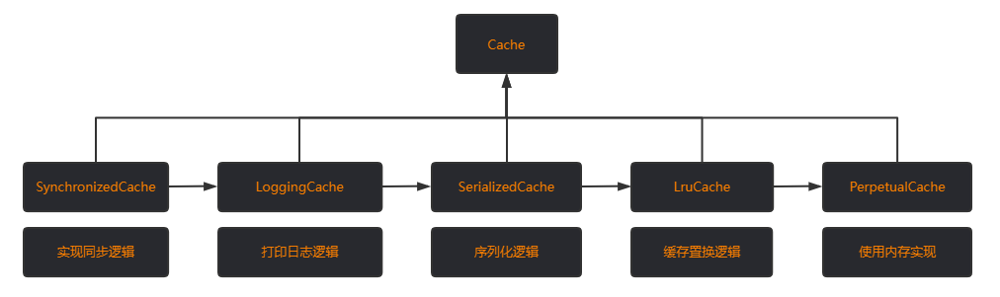
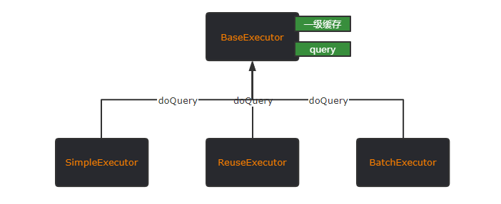
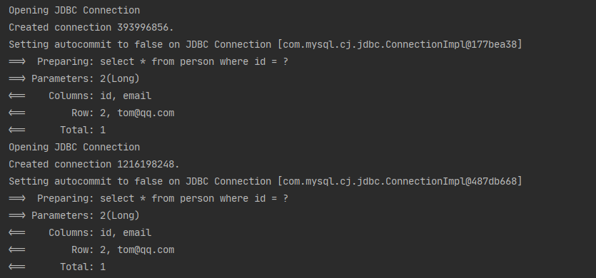

# Mybatis 中的缓存

大家都知道 Mybatis 在查询中使用了缓存来提高查询速度，且 Mybatis 的缓存使用已经封装的很好了，几乎不用我们做任何操作。但是本着知其然知其所以然的态度还是需要简单的了解下它缓存实现的原理，而且 Mybatis 缓存实现使用的设计模式也很值得学习。

# 一级缓存

Mybatis 一级缓存是基于会话的缓存（sqlsession）。所以缓存只有在同一个 SqlSession 中才能共享

## 数据结构

[一级缓存](https://gitee.com/lkyQ/mybatis-3/blob/master/src/main/java/org/apache/ibatis/executor/BaseExecutor.java#L58)定义在 BaseExecutor 中，是一个成员变量

```java
protected PerpetualCache localCache;
```

它的[底层数据类型](https://gitee.com/lkyQ/mybatis-3/blob/master/src/main/java/org/apache/ibatis/cache/impl/PerpetualCache.java#L27)其实就是一个 HashMap。有人可能会有疑问，这里为什么不使用线程安全的 Map？

答案是：SqlSession 本身就不是线程安全，所以这里使用 HashMap 就够了


一级缓存的实现逻辑在类 `BaseExecutor` 中，使用了模板方法模式

BaseExecutor 中定义了两个方法 **query 和 doQuery**。query 是 BaseExecutor 实现的，doQuery 是抽象方法，需要子类实现查询数据库的逻辑。query 中会调用 doQuery

执行 query 的时候，首先会进行判断：有没有自定义结果处理器（ResultHandler），如果有的话会直接返回 null。因为缓存中的数据类型是已经固定的，所以不再支持自定义 ResultHandler 去处理

如果没有 ResultHandler ,才会到缓存里面获取数据。获取到就返回，如果没有获取到，则执行子类实现的 doQuery 查询数据库，然后将结果集放入到缓存中。

代码地址：https://gitee.com/lkyQ/mybatis-3/blob/master/src/main/java/org/apache/ibatis/executor/BaseExecutor.java#L325


## 关闭一级缓存

一级缓存默认是开启的，如果需要关闭的话要在 mybatis 配置文件中添加一个设置修改一级缓存作用域

```java
<!-- 默认是 SESSION -->
<setting name="localCacheScope" value="STATEMENT"/>
```

但是注意，这里并没有完全关闭一级缓存。只是将它的作用域调整成了：**在嵌套查询的时候生效**，[代码如下](https://gitee.com/lkyQ/mybatis-3/blob/master/src/main/java/org/apache/ibatis/executor/BaseExecutor.java#L169)

```java
//每次查询的时候会判断，如果一级缓存作用域为 STATEMENT 就会清空
if (configuration.getLocalCacheScope() == LocalCacheScope.STATEMENT) {
    // issue #482
    clearLocalCache();
}

public void clearLocalCache() {
    if (!closed) {
        localCache.clear();
        localOutputParameterCache.clear();
    }
}
```


# 二级缓存

Mybatis 中的二级缓存是全局的，它的作用域比一级要大，是 Namespace 级别的。二级缓存默认是关闭的，打开它需要满足两个条件

1. mybatis 配置文件中开启了全局缓存 （默认为true）

```xml
<setting name="cacheEnabled" value="true"/>
```

1. 在对应编写 sql 语句的 xml 映射文件中添加 `<cache/>` 标签

```xml
<cache/>
```

## 设计模式

二级缓存的结构使用了责任链模式，所有的缓存处理器都实现了顶级接口 `Cache` ，然后内部也使用组合的方式每一层都只实现自己的逻辑，然后其余交给 委托对象 去执行，直到最后一个，如下图。



简单看下 [SynchronizedCache ](https://gitee.com/lkyQ/mybatis-3/blob/master/src/main/java/org/apache/ibatis/cache/decorators/SynchronizedCache.java#L23)的代码，他是最外层的 Cache 处理器，构造函数也要传入一个 Cache 作为委托对象

```java
public class SynchronizedCache implements Cache {

  //委托对象
  private final Cache delegate;

  public SynchronizedCache(Cache delegate) {
    this.delegate = delegate;
  }

//实现同步的逻辑也是简单粗暴，直接在方法上添加 synchronized 关键字
@Override
 public synchronized void putObject(Object key, Object object) {
    //同步逻辑实现后交给委托对象去执行下一步操作
    delegate.putObject(key, object);
 }
```

而 [PerpetualCache](https://gitee.com/lkyQ/mybatis-3/blob/master/src/main/java/org/apache/ibatis/cache/impl/PerpetualCache.java#L27) 则不需要传入委托对象，因为他是兜底的（最后执行的）

## 实现原理

一级缓存的实现是通过继承和模板方法模式去实现的，父类 BaseExecutor 在 query 方法中查询缓存不存在则调用子类实现的 doQuery 去查询数据库，如下图




那么我们可以把二级缓存的逻辑也写在 BaseExecutor 中吗？

答案是**当然可以，但是不建议**，因为这样会增加代码的复杂度。所以 Mybatis 使用了装饰器模式来简化代码

实现方式是：

新增了一个 `CachingExecutor` 用来做二级缓存的管理，它也实现了 Executor 接口， 且内部使用组合的形式又保存了一个 Executor 对象，除了二级缓存管理以外的所有操作都会委托给这个对象进行处理，该委托对象其实就是 BaseExecutor 的子类

```java
public class CachingExecutor implements Executor {

  private final Executor delegate;
  private final TransactionalCacheManager tcm = new TransactionalCacheManager();

  public CachingExecutor(Executor delegate) {
    this.delegate = delegate;
    delegate.setExecutorWrapper(this);
  }
    
    //省略其余代码...
}
```

这里我们可以猜想一个问题：如果一级和两级缓存都开启，那么先访问谁？

先说答案，**先访问二级缓存。** 
我们从二级缓存的设计上也可以看出来。假设二级缓存现在没值，那肯定要调用委托对象去查询，根据迪米特原则，委托对象查询的过程对二级缓存来说是应该是透明的（它也不知道委托对象究竟是查询的数据库还是一级缓存）且委托对象每次都会返回值给它，所以如果是先查询一级缓存，那么二级缓存就没有存在的必要了。这里只是一个猜想，具体是不是后面再看代码逻辑。

### CachingExecutor 的创建时机

SqlSession 创建 Executor 的时候，会先创建一个 BaseExecutor (默认是SimpleExecutor)。然后判断有没有开启配置 **cacheEnabled** ，开启了则会创建 CachingExecutor 并将之前创建的 BaseExecutor 作为它的委托对象。如果没有开启则直接返回刚创建的 BaseExecutor ，[代码](https://gitee.com/lkyQ/mybatis-3/blob/master/src/main/java/org/apache/ibatis/session/Configuration.java#L667)如下

```java
Executor executor;
if (ExecutorType.BATCH == executorType) {
    executor = new BatchExecutor(this, transaction);
} else if (ExecutorType.REUSE == executorType) {
    executor = new ReuseExecutor(this, transaction);
} else {
    executor = new SimpleExecutor(this, transaction);
}
if (cacheEnabled) {
    executor = new CachingExecutor(executor);
}
```

### 流程

入口还是先执行 query 方法，如果命中二级缓存直接返回。如果该 mapper 没有开启二级缓存或者未命中则将查询委托给 BaseExecutor 去执行，拿到返回结果后再放入二级缓存然后返回。**所以之前的猜想是正确的，的确是先查询的二级缓存**

```java
public <E> List<E> query(MappedStatement ms, Object parameterObject, RowBounds rowBounds, ResultHandler resultHandler, CacheKey key, BoundSql boundSql)
    throws SQLException {
    //这里如果没有在 mapperxml 文件中添加 <cache/> 标签，会为 null 
    Cache cache = ms.getCache();
    if (cache != null) {
        //是否刷新二级缓存，也是在配置文件中配置 flushCache
        flushCacheIfRequired(ms);
        //这里会判断 ms 是否要使用二级缓存，默认查询操作开启（标签必须是SELECT）
        //还有不能自定义结果集，同一级缓存一样，缓存的数据格式已经固定了，不支持再自定义处理
        if (ms.isUseCache() && resultHandler == null) {
            ensureNoOutParams(ms, boundSql);
            @SuppressWarnings("unchecked")
            //从缓存中取值
            List<E> list = (List<E>) tcm.getObject(cache, key);
            //如果没取到则委托给 BaseExecutor 去查询
            if (list == null) {
                list = delegate.query(ms, parameterObject, rowBounds, resultHandler, key, boundSql);
                tcm.putObject(cache, key, list); // issue #578 and #116
            }
            return list;
        }
    }
    //如果没开启二级缓存
    return delegate.query(ms, parameterObject, rowBounds, resultHandler, key, boundSql);
}
```

这里有几个地方做一下特殊说明

1.  `ms.getCache()` 的值从哪来的

在解析 mapperxml 标签的只会时候，会进行一个判断，如果包含 cache 标签则才会进一步的去创建缓存，不包含的话直接就返回 null 了

1. `ms.isUseCache()` 的判断和 `cache != null` 的判断并不冲突

后者的判断主要是判断 xml 中有没有 cache 标签，而前者主要是判断是否为查询操作，因为增删改是不需要添加缓存的

## 缓存不生效的原因

现在有一段代码（开启了二级缓存），创建两个 SqlSession 去执行同一个查询。按理来说应该只会查询一次，剩余的一次会走二级缓存

```java
@Test
public void test(){
   SqlSession sqlSession = sqlSessionFactory.openSession();
   SqlSession sqlSession1 = sqlSessionFactory.openSession();

   PersonMapper mapper = sqlSession.getMapper(PersonMapper.class);
   PersonMapper mapper1 = sqlSession1.getMapper(PersonMapper.class);

   mapper.getById(2L);
   mapper1.getById(2L);
}
```

但是执行后控制台打印



可以很清楚的看到，还是去查询了两次数据库。这是为什么呢？

原因很简单：**二级缓存必须要提交了事务后才能读取到，因为要避免脏数据**

二级缓存是一个全局的缓存，所以会存在多线程共享的问题。假设现在有两个线程操作同一个 mapper，操作流程如下：

1. sqlSession1 中插入了数据 A
2. sqlSession1 查询了数据库 **，将 A 放入到二级缓存中**
3. sqlSession2 查询读到了缓存中的 A
4. sqlSession1 Rollback 了

假设在 sqlSession1 查询完后不需要提交事务就把 A 放入到二级缓存中，那么 sqlSession2 读到的肯定是缓存中的 A，然后数据 A 又被回滚掉了，这时候 sqlSession2 中的数据 A 就成了脏数据

所以，**提交事务后二级缓存生效是很有必要的**，这一点要注意


然后来看一下实现的过程

1. [第一次未命中二级缓存，去查询数据库获取数据](https://gitee.com/lkyQ/mybatis-3/blob/master/src/main/java/org/apache/ibatis/executor/CachingExecutor.java#L102)
2. [将数据放入到二级缓存的一个缓冲区](https://gitee.com/lkyQ/mybatis-3/blob/master/src/main/java/org/apache/ibatis/cache/decorators/TransactionalCache.java#L81)（entriesToAddOnCommit 该缓冲区不可被其他 session 读取）
3. [提交了事务将数据更新到二级缓存](https://gitee.com/lkyQ/mybatis-3/blob/master/src/main/java/org/apache/ibatis/executor/CachingExecutor.java#L120)
4. [如果没提交事务且发生了异常，缓冲区的内容也会被清除](https://gitee.com/lkyQ/mybatis-3/blob/master/src/main/java/org/apache/ibatis/executor/CachingExecutor.java#L129)

之前对为什么要提交了才能读到二级缓存有点疑问，后来看下了 [Issues](https://github.com/mybatis/mybatis-3/issues/105#issuecomment-29474341) 就懂了。